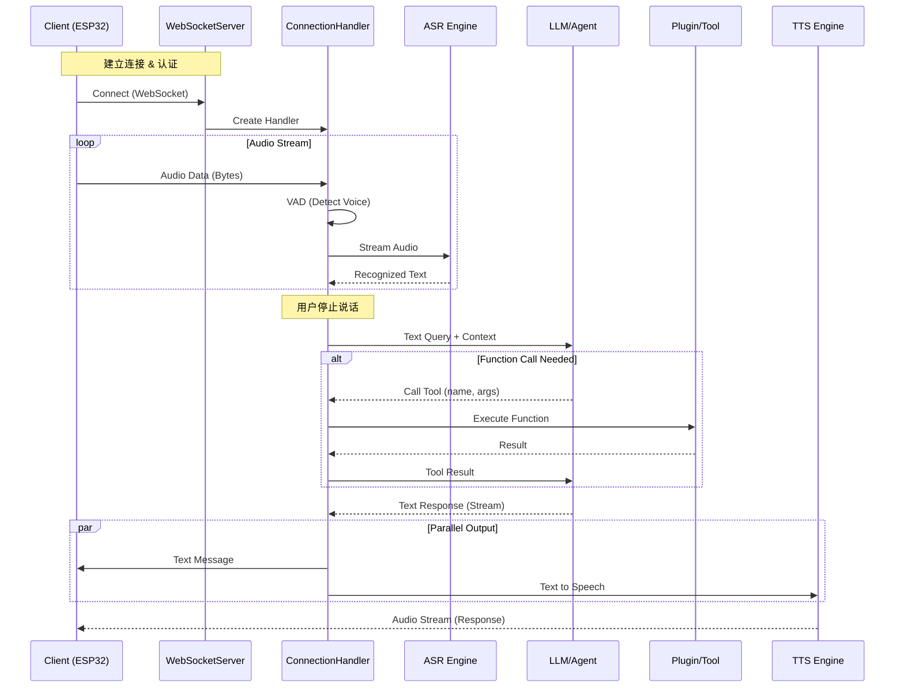

# Xiaozhi Server 项目分析文档

本文档对 Xiaozhi Server (ESP32-Server) 的项目结构、核心模块功能以及系统运行链路进行详细分析。

## 1. 项目概览

本项目是一个基于 Python `asyncio` 的异步服务器，通过 WebSocket 与客户端（如 ESP32 设备）进行实时语音交互。核心功能包括语音活动检测 (VAD)、自动语音识别 (ASR)、大语言模型 (LLM) 对话、文本转语音 (TTS) 以及意图识别与插件系统。

## 2. 目录结构说明

Markdown
- **`app.py`**: 程序入口，负责启动 WebSocket 服务和 HTTP 服务。
- **`config/`**: 配置文件与配置加载逻辑。
  - `config.yaml`: 核心配置文件。
  - `settings.py`: 配置加载与校验。
- **`core/`**: 核心逻辑模块。
  - `websocket_server.py`: WebSocket 服务器实现，处理连接建立与分发。
  - `http_server.py`: HTTP 服务器实现，提供 OTA 和辅助 API。
  - `connection.py`: **核心**，`ConnectionHandler` 类管理单个连接的全生命周期（语音流处理、对话逻辑）。
  - `auth.py`: 认证管理。
  - `providers/`: 各类能力提供者（ASR, TTS, LLM 等）。
  - `handle/`: 消息与业务处理句柄。
- **`plugins_func/`**: 插件系统。
  - `register.py`: 插件注册机制。
  - `functions/`: 具体插件实现（如天气、新闻、IoT控制）。
- **`docs/`**: 项目文档（本文档所在位置）。

## 3. 功能模块详解

### 3.1 启动流程 (`app.py`)
1.  **加载配置**：从 `config.yaml` 或 API 加载配置。
2.  **服务启动**：
    -   `WebSocketServer`: 监听 8000 端口 (默认)，用于主业务交互。
    -   `SimpleHttpServer`: 监听 8003 端口 (默认)，用于 OTA 升级和视觉分析接口 (`/mcp/vision/explain`)。
3.  **进程守护**：使用 `asyncio` 运行主循环，并监听系统信号及 `stdin` 以保持运行。

### 3.2 WebSocket 服务 (`core/websocket_server.py`)
-   **连接管理**：为每个新连接创建一个独立的 `ConnectionHandler` 实例。
-   **认证**：通过 `AuthManager` 验证 `Authorization` 头或 URL 参数。
-   **配置热更新**：支持通过 API 动态更新全局配置，并重新初始化共享组件 (ASR/VAD/LLM)。

### 3.3 核心连接处理 (`core/connection.py`)
`ConnectionHandler` 是业务逻辑的核心枢纽，负责协调各个组件：

1.  **输入处理**：
    -   接收 WebSocket 二进制音频流或文本消息。
    -   支持解析 MQTT 网关转发的封装音频包 (带头部信息)。
2.  **语音链路**：
    -   **VAD (Voice Activity Detection)**：检测用户是否在说话。
    -   **ASR (Automatic Speech Recognition)**：将音频流实时转换为文本。
3.  **对话逻辑**：
    -   **意图识别 (Intent)**：判断用户意图（如查询天气、控制设备）。
    -   **对话管理 (Dialogue)**：维护对话历史和上下文。
    -   **LLM 交互**：将用户输入 + 上下文 + 系统提示词发送给 LLM。
4.  **输出处理**：
    -   **TTS (Text-to-Speech)**：将 LLM 的文本回复转换为音频。
    -   **流式响应**：将文本和音频实时流回传给客户端。

### 3.4 插件与工具系统 (`plugins_func/`)
-   **机制**：通过装饰器 (`@register_function`) 注册函数。
-   **调用**：`UnifiedToolHandler` 负责接收 LLM 的 Function Call 请求，查找并执行对应插件，将结果返回给 LLM 生成最终回复。
-   **典型插件**：
    -   `get_weather.py`: 获取天气。
    -   `hass_*.py`: Home Assistant 智能家居控制。
    -   `play_music.py`: 音乐播放控制。

## 4. 全链路数据流图

## 5. 关键特性

-   **全双工交互**：支持打断 (Barge-in)，通过 VAD 实时检测用户语音。
-   **多模态支持**：除了语音，通过 HTTP 接口支持视觉分析 (MCP Vision)。
-   **高度可配置**：支持本地 YAML 配置和云端 API 配置，组件 (LLM, ASR, TTS) 可灵活替换。
-   **扩展性**：基于 Python 装饰器的插件系统，易于添加新功能。
